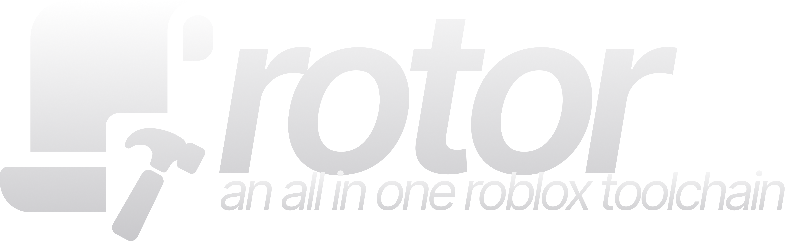

<p align="center">
  
</p>

<p align="center"><em>TypeScript in, Roblox out — at native speed.</em></p>

<p align="center">
  <a href="https://github.com/uproot/rotor/releases/latest"></a>
  <a href="https://github.com/uproot/rotor/actions/workflows/ci.yml"></a>
  <a href="LICENSE"></a>
</p>

rotor is an all-in-one Roblox toolchain, written in Go. At its core is a native rewrite of the [roblox-ts](https://roblox-ts.com) compiler built on [typescript-go](https://github.com/microsoft/typescript-go) — a drop-in `rbxtsc` replacement with **byte-identical Luau output** — alongside a native Luau bundler, minifier, dev loop, and packer (`bundle`, `minify`, `dev`, `pack`).

```
$ rotor check ./my-game -w
rotor check — native TypeScript checking
checked 222 files in 161 ms — 0 errors
```

📖 [Documentation](docs.md) · 🤝 [Contributing](CONTRIBUTING.md) · 🗺️ [Roadmap](roadmap.md)

## Install

Grab a binary from [GitHub Releases](https://github.com/uproot/rotor/releases), or use a toolchain manager:

```sh
# mise
mise use -g github:uproot/rotor@1.4.0

# rokit
rokit add uproot/rotor@1.4.0
```

```toml
# aftman.toml
[tools]
rotor = "uproot/rotor@1.4.0"

# foreman.toml
[tools]
rotor = { github = "uproot/rotor", version = "1.4.0" }
```

### Install via npm / bun

For rbxts projects that already live in the JS ecosystem, install [`@rotor/cli`](https://www.npmjs.com/package/@rotor/cli) as a dev dependency — a postinstall step downloads the prebuilt binary for your platform:

```sh
bun add -d @rotor/cli
npm i -D @rotor/cli
pnpm add -D @rotor/cli
yarn add -D @rotor/cli
```

Installing straight from GitHub works too: `bun add -d github:uproot/rotor` (npm/pnpm/yarn equivalents likewise).

> **bun note:** bun skips postinstall scripts by default. Either add `"trustedDependencies": ["@rotor/cli"]` to your project's `package.json` (then `bun install`), or do nothing — the `rotor` shim downloads the binary on first run. pnpm similarly asks you to approve build scripts (`pnpm approve-builds`), with the same first-run fallback.

Or build from source (Go 1.25+):

```sh
git clone https://github.com/uproot/rotor && cd rotor
go build ./cmd/rotor
```

Then point it at any rbxts project:

```sh
rotor check ./my-game      # native, full-strictness typecheck
rotor build ./my-game -w   # compile to Luau, watch mode
```

See the [documentation](docs.md) for all commands (`doctor`, `bundle`, `minify`, `dev`, `pack`) and options.

## Benchmarks

Measured on real production rbxts games, with output byte-identical to `rbxtsc` 3.0.0:

| Workload | rotor |
|----------|------:|
| Full strict typecheck — 222-file production game | **161 ms** |
| Full build — 95-file production game | **355 ms** |
| Incremental watch rebuild — same game | **180 ms** |

The JS toolchain spends longer than this booting Node. The ~10× speedup is structural: rotor runs Microsoft's native, parallel TypeScript compiler ([typescript-go](https://github.com/microsoft/typescript-go)) instead of the single-threaded JS one.

## Contributors

<a href="https://github.com/uproot"></a>
<a href="https://github.com/Coyenn"></a>

Contributions welcome — see [CONTRIBUTING.md](CONTRIBUTING.md).

## License

[MIT](LICENSE). rotor stands on [roblox-ts](https://github.com/roblox-ts/roblox-ts) (MIT) and [typescript-go](https://github.com/microsoft/typescript-go) (Apache-2.0) — see [credits](docs.md#credits--licenses).
